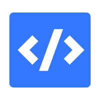

# This is Code Snippets of Element Plus for VS Code.

Continuously updating 持续更新中

# Logo

# Basic Part

|  NO   |   key           | element Tag     |
|  ---- |   ----          | ----------      |
| 1     |    Slog         | console.log     |
| 2     |   Eltab         | el-tabs         |
| 3     |   Elbtn         | el-button       |
| 4     |   Ellink        | el-link         |
| 5     |   Eltext        | el-text         |
| 6     |   Elscrollbar   | el-scrollbar    |
| 7     |   Elselect      | el-select       |
| 8     |   Elswitch      | el-switch       |

# How to make a Vscode Snippets
 https://www.yuque.com/alipaytdm4pz8prz/fagota/uotrysrk14i9ckeu?singleDoc# 
《如何创建一个VsCode 代码 片段》

## Release Notes

### 1.0.0

Initial release of `elementplus-snippets`.
